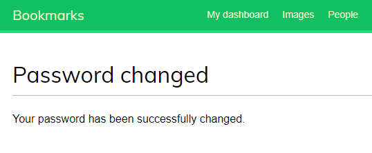
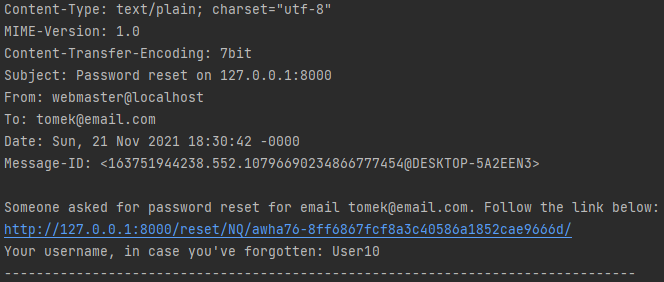
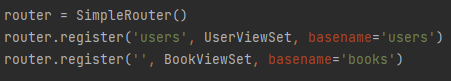

## Zadania 2 i 3
### Przedstawienie rozwiązania
---------------------------------
---------------------------------
# Zadania z Lab2
---------------------------------

Wygląd strony do logowania użytkownika.

Po wejściu w 'register here' przechodzimy do formularzu z rejestracją.

Po zarejestrowaniu widzimy widok witający nowego użytkownika. Po kliknięciu 'log in' wracamy do widoku logowania.

W przypadku podania błędnych danych logowania dostajemy taki warrning.

Gdy wprowadzone dane są poprawne przechodzimy do 'dashboarda', gdzie mamy możliwość edycji naszego profilu lub zmianę hasła.

Po wejściu w edycję przechodzimy do widoku zmiany w koncie.

Gdy wprowadzony format danych będzie błędny dostaniemy error.

Jeżeli będą poprawne dostajemy informację o sukcesie.

Gdy w dashboardzie wejdziemy w opcję zmiany hasła przechodzimy do podstrony z formularzem do tego przeznaczonym.

Widok po poprawnej zmianie hasła.

Widok po wylogowaniu.

Widok przypomnienia hasła, wejście do formularza dostępne jest przy logowaniu.

Informacja o wysłaniu wiadomości email prowadzącym do przypomnienia hasła.

Widok z konsoli dotyczący wysłania maila.

---------------------------------
# Zadania z Lab3
---------------------------------

Po prawej stronie widać nowe możliwości logowania: przez konto na facebooku i konto google.

Po wybraniu pierwszego wariantu zostajemy przeniesieni na stronę facebooka, która spyta nas (jeżeli jesteśmy już zalogowani na koncie) czy chcemy kontynuować logowanie kontem facebooka.

Po zalogowaniu widać w prawym górnym rogu, że zostałem zalogowany jako "Alex".

Po wybraniu drugiej opcji logowania przeniesieni zostaniemy do widoku logowania google. W przypadku gdy jesteśmy zalogowani już musimy wybrać, z którego konta chcemy kontynuować.

Po zalogowania z konta google widać, że na stronie jestem zalogowany jako "Alexacy".

---------------------------------
# Zadania z Lab4
---------------------------------

Panel admina, w którym widać dodane tokeny

Spis wszystkich książek dodanych pod /books/

Interfejs REST API
Widać w nim wszystkie dodane książki, możemu w nim również dodać kolejne

Każda z książek posiada swój tytuł, podtytuł, autora oraz numer ISBN

Każdą książkę można podejrzeć z osobna

Opcja GET pokazuje nam książkę (lub książki) jako obiekt typu JSON

Pod /api/users/ posiadamy listę wszystkich użytkowników. Jest ona dostępna jednak tylko osobom zarejestrowanym

Na dole widać formularz dodawania nowego użytkownika

Istnieje również możliwość podejrzenia konkretnego usera po dodaniu do URLa id

Dodany został też swagger dostępny pod /swagger-docs/, który jest narzędziem pomagającym tworzyć i dokumentować usługi REST API

---------------------------------
# Zadania z Lab6
---------------------------------

Użycie Viewsets __api/views.py__ :

Użycie Routers __api/urls.py__ :

Użycie Serializers __api/serializers.py__ :

Uwierzytelnianie __api/bookmarks/settings.py__ :

Dodanie __rest_framework.authtoken__ w __bookmarks/settings.py__ :

Dzięki temu w panelu admina widzimy, że została dodana zakładka z tokenami:

__Licznik odwiedzin na stronie wykorzystujący pliki cookies:__

Funkcja w __api/views.py__:

Dodany url do licznika:

__Komunikat przy pierwszej wizycie__:

__Komunikat przy następnych wizycie__:

