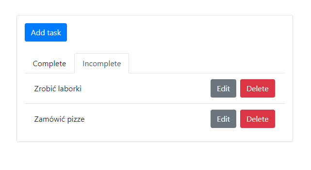
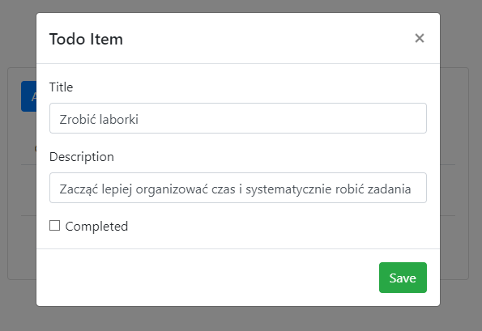
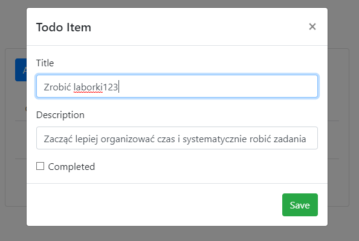
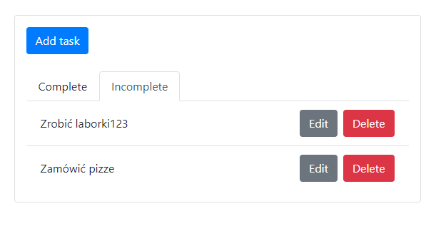
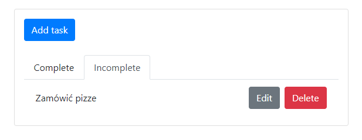
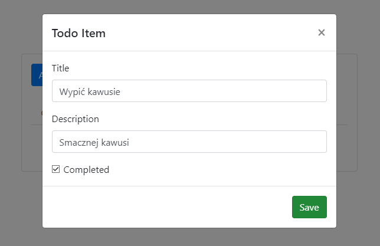
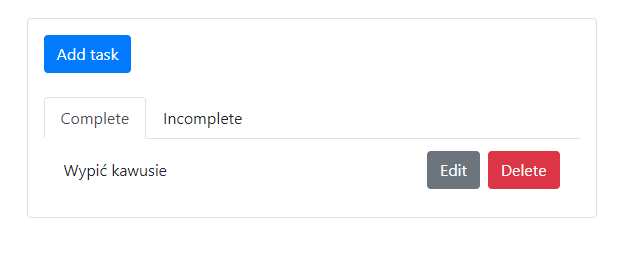

## Zadanie 8 Aplikacja typu TODO (Django + React)

Aplikacja zrobiona na podstawie poradnika [digitalocean](https://www.digitalocean.com/community/tutorials/build-a-to-do-application-using-django-and-react)

Podgląd aplikacji:

Podejrzenie opisu:

Edycja:

Usuwanie:

Dodawanie skończonego taska:

Podgląd skończonych tasków

